# StudyPro PJT :man_student:

언제 어디서나 모일 수 있는 공간, 스터디프로입니다. 

간편하게 스터디를 찾아보고, 클릭 한 번으로 스터디원과 만나보세요! 온라인이지만 실제로 옆에 있는 것처럼 내 화면을 보여주고, 얼굴을 마주보면서 이야기할 수 있다면 어떨까요? 놀라운 스터디의 새로운 플랫폼, 스터디프로를 보여드리겠습니다. 


## 서비스 설명 :artificial_satellite:

스터디프로만의 두 가지 핵심기능을 소개합니다!


### 1. 온라인 스터디 - 워크스페이스

원격이지만 바로 옆에 있는 것처럼 같이 스터디를 할 수 있어요. 노트북에 있는 웹캠을 통해서 화상회의, 실시간 채팅, 화이트 보드, 쉐어뷰, 노트패드와 같은 기능을 제공합니다. 

- 화이트보드

  팀원들과 같이 그림을 그리면서 알고리즘, 서비스 기획 등을 설명할 수 있는 공간입니다.

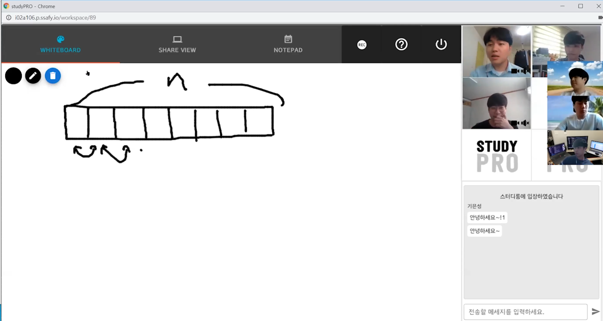


- 쉐어 뷰

  온라인이지만 바로 옆에 있는 것처럼! 내 화면을 공유해서 같이 볼 수 있어요. 특히, 코드나 PPT등 세부적으로 화면을 보면서 이야기해야 하는 작업에는 굉장히 유용합니다 .

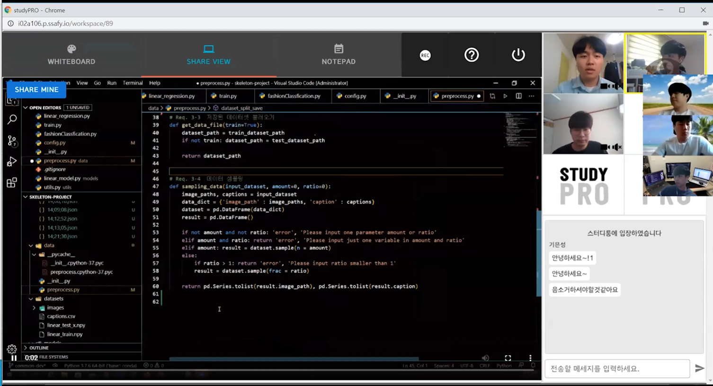


- 노트패드 

  팀원들과 동시에 문서를 수정할 수 있는 공간이에요. 로컬에 있는 문서를 불러와서 실시간으로 팀원들과 같이 수정할 수 있습니다. 마크다운 형식도 지원이 되서  README.md 를 작성하기에 완전 완성맞춤입니다.

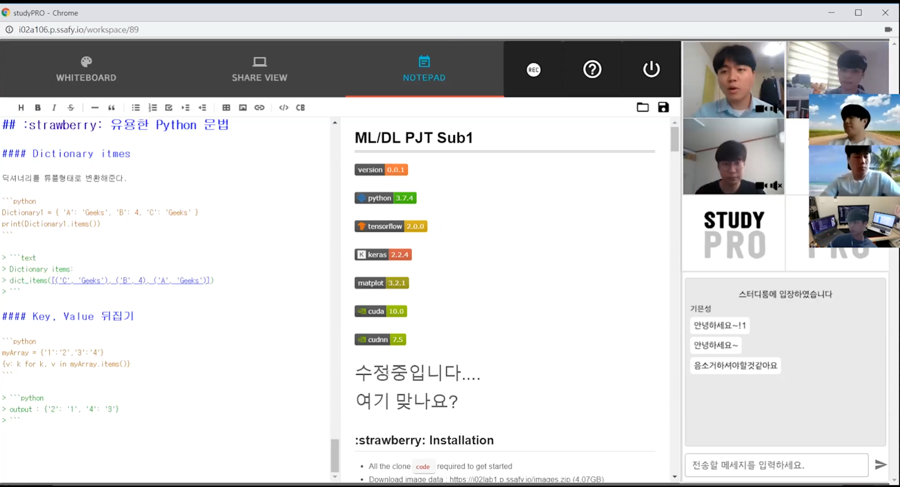


- 녹화 기능

  워크스페이스 공간에서 한 스터디 활동을 녹화할 수 있어요! "어 이거 옛날에 공부했던건데" 라고 생각만 하면서 까먹고 놓치는 일은 이제 없을 거에요. 

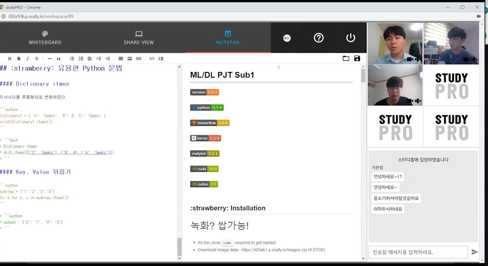


### 2. 스터디 활동 관리

같이 만나는 것으로만은 스터디가 유지되기 힘들죠. 저희는 스터디가 지속적으로 유지되고 활동을 관리할 수 있는 서비스도 같이 제공합니다. 온라인 스터디 활동을 녹화해서 같이 공유할 수도 있죠. 그리고 스터디 스케쥴을 같이 관리하면서, 스터디 이벤트나 일정도 참여할 수 있습니다.

- 스터디 검색 및 매칭

  내가 원하는 스터디를 쉽고 빠르게 매칭할 수 있습니다. 이름으로도 간편하게, 그리고 내가 원하는 시간대에 맞춰서 스터디를 찾을 수 있죠. 

  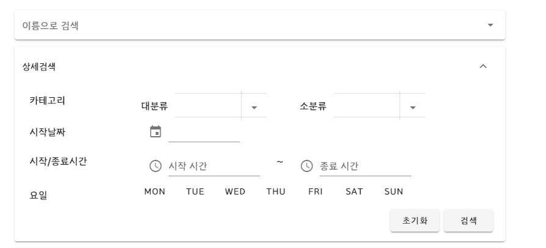


- 스터디 일정 관리

  스터디 일정을 캘린더에 추가하면 알림으로 확인할 수 있습니다. 스터디 세미나나 스터디 자체 활동을 관리하기에 굉장히 편리합니다. 

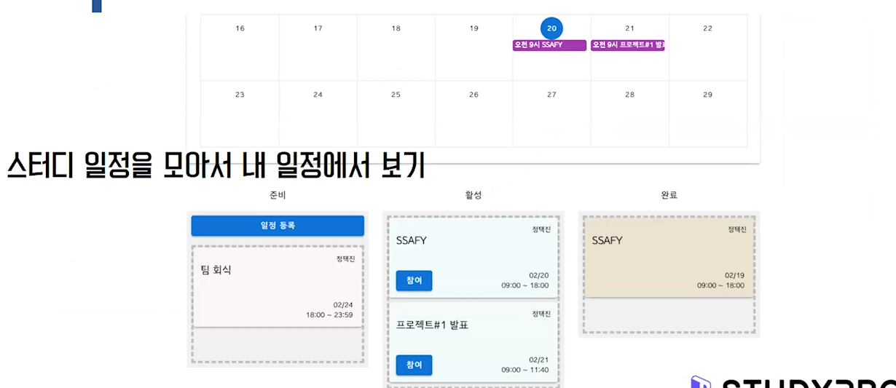


- 스터디원과 자료 공유

  따로 스터디원과 자료를 공유하기 위해 타 플랫폼을 이용하지 않아도 되요. 스터디만의 게시글오 서로 이야기할 수 있습니다. 그리고 첨부파일이 가능하니, 스터디에 필요한 자료도 같이 공유할 수 있죠.

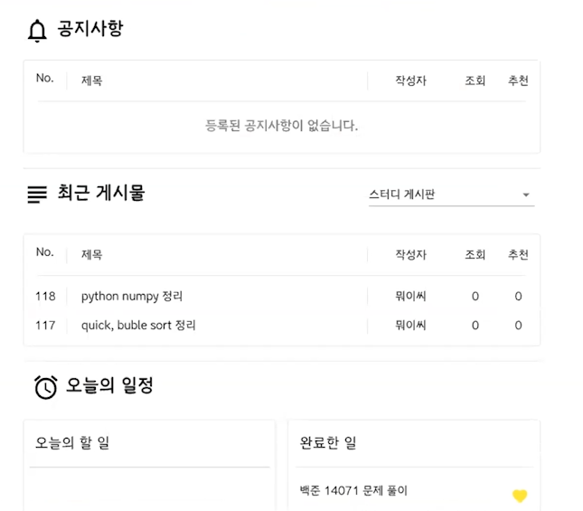


## 사용 설명서 :hand:

### 설치하기

:point_right: **bash 환경**에서 다음 명령어 실행하기

`git clone https://github.com/swimminglee/studypro`


### 실행하기

:point_right: Front-end

```bash
cd studypro/front
npm install 
npm build
cp dist $DEPLOY_PATH
```

:point_right: Back-end

```bash
cd studypro/back
npm install
pm2 start
```


> 개발할때는 젠킨스를 이용하여 배포하였습니다. 


## 핵심 서비스 기술 :athletic_shoe:

### webRTC를 이용한 스터디원 연결 구조


### redis를 이용한 트랜젝션 증가

#### 1. 요구: 서버 요청시간을 더 빠르게 만들고 싶다.
   - 서버 요청시간을 더 빠르게 만들고 싶어서 여러가지 대안을 고려해봤습니다. 
   - 빈번한 요청에 대한 캐싱 정책, 데이터에 따라 HTTP 세부 프로토콜 설정, 등을 고려해봤고 우선적으로 적용하기 쉬운 `redis`를 이용해봤습니다. 


#### 2. redis를 어떻게 이용할까? redis를 어떻게 사용할 수 있을까?

   

   - reid는 RDBMS에 직접적으로 접근하것보다 더 빠르게 처리하기 위한 일종의 인모메리 DB이다.
   - redis가 사용되는 곳
     - 채팅, 메시징 대기열
     - 게임 순위표
     - 세션 스토어
   - 스터디프로에서는 `가장 빈번하게 요청`되는 페이지는 메인페이지였고, 그 중에서 `로그인여부와 상관없이` 보내는 스터디 목록데이터가 있었습니다. 그래서 이 데이터를 캐싱하면 성능 향상에 도움이 될거라 판단!


#### 3. 캐싱 정책을 어떻게 할까?

- 캐싱을 잘못하면 원래 데이터는 변경되었는데, 캐시가 가지고 있는 데이터는 옛 데이터를 들고 있을 수 있다. 
- 실제 DB에 데이터가 변경되면 redis에 있는 데이터도 같이 변경될 수 있도록 구성했다. 
- 추가적으로 redis에서 가지고있는 캐시에 만료시간을 설정하여 시간이 지나면 DB에 요청해서 데이터를 갱신하도록 설정했다. 


#### 4. redis를 사용했는데 얼마나 트랜젝션이 증가했나?

- 과연 redis를 적용하면 얼마나 빨라졌을까? redis 적용 전 응답시간과 TPS를 비교해봐았습니다. 
- 부하테스트는 120초간 100유저 성능 테스트를 진행하였다. 
- redis 적용 전

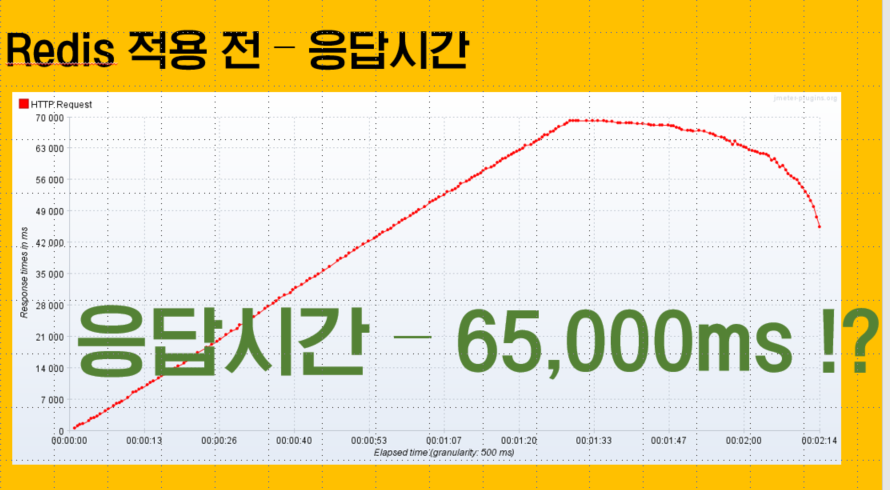

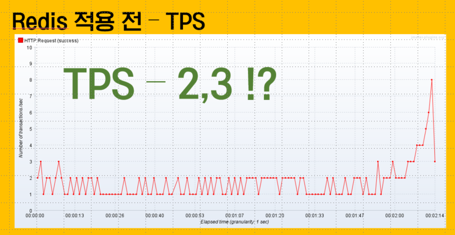

- redis 적용 후

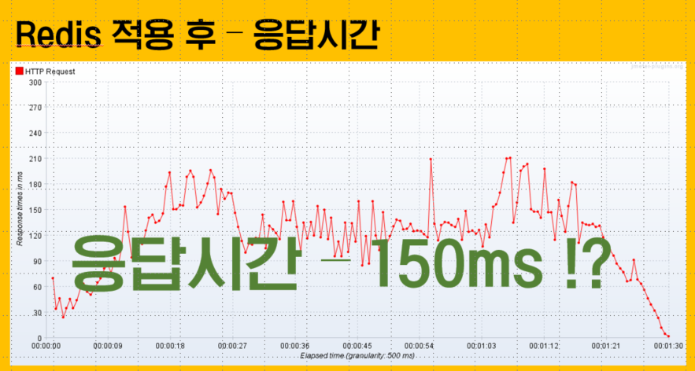

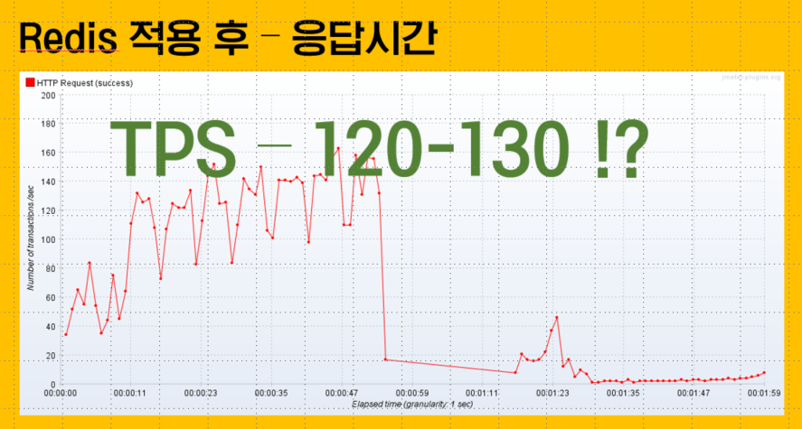


- 위에서 보다시피 부하 테스트를 걸면 TPS가 120-130씩 나오다가 갑자기 요청이 뚝 떨어지는 모습이 발견되었다. 원인을 확인한 결과 TCP 프로토콜의 TIME_WAIT 설정때문에 포트가 계속 유지되어 테스트에 사용할 수 있는 포트가 고갈되었기 때문이다. 
- 포트 고갈문제는 윈도우 레지스터에디터에서 TIME_WAIT 변수를 낮추어 변경하여 해결할 수 있었다. 해결된 그래프는 TPS가 120-150으로 계속 나왔다. 

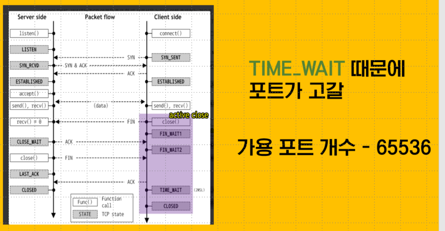


#### 5. 교훈

redis을 이용하여 기존대비 50배의 TPS 향상을 맛볼 수 있었다. 그러나 이 50배는 유저가 메인페이지가 계속 접근하였을때의 기준치이다. 유저가 메인 페이지에 들어오는 접근이 단위시간당 많아지면 많이질 수록 성능을 향상될 것이다. 

단순히 redis를 적용해보는 것 뿐만 아니라 정량적으로 판단해보는 것도 큰 도움이 되었다. 캐싱정책에 따라, 그리고 캐싱 데이터에 따라 어떻게 TPS가 변화하는지도 따져봐야 한다. 